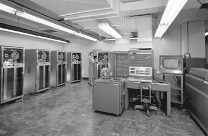
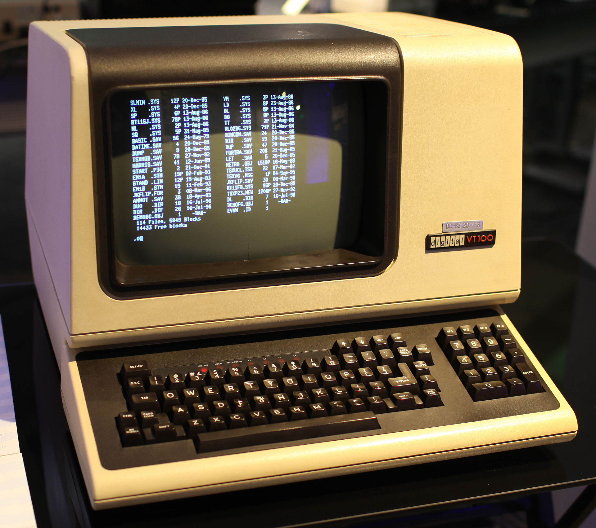

In the early days of computing, computers were called *mainframes* and filled
a big room. To let the perform computations, you have to feed them punch-cards,
so most of the time it's users were busy sitting behind a desk punching holes
in pieces of paper. When they were done, they would leave the punch cards in
a mailbox, and after some time, receive punch cards generated by the computer.

For the users of these computers, the *computer terminal* with a screen and
keyboard was a very welcome innovation.



